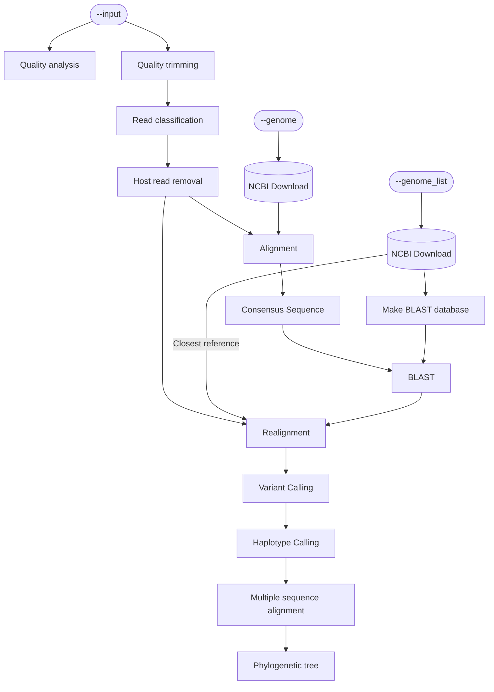

<!-- markdownlint-disable -->
<p align="center">
  
</p>

# YAVSAP (Yet Another Viral Subspecies Analysis Pipeline)

[](https://github.com/ksumngs/yavsap/actions/workflows/ci.yml)
[](https://ksumngs.github.io/yavsap)
[](https://www.repostatus.org/#wip)
[](https://www.nextflow.io/)
[](https://github.com/ksumngs/yavsap/blob/master/CHANGELOG.md)
[](https://github.com/ksumngs/yavsap/blob/master/LICENSE)

<!-- markdownlint-enable -->

A [Nextflow] pipeline for studying viral populations within a single sample,
tuned for [Japanese Encephalitis Virus].
:dna::computer::chart_with_upwards_trend: Yeah, we're still looking for a better
name. :shrug:

> This project follows the [semver] _pro forma_ and uses the [git-flow]
> branching model.

## Installation

1. Install [Nextflow] (>= 21.10.6)
2. Install [Conda]
3. Install one or more of
   - [Singularity] (**Recommended**)
   - [Podman]
   - [Docker]
4. Download a [Kraken2 database]

Check out the [Installation] docs for a more nuanced take on the requirements.

## Usage

### Syntax

```bash
nextflow run ksumngs/yavsap              \
  -profile <singularity,podman,docker>   \
  --platform <illumina,nanopore>         \
  --kraken2_db /path/to/kraken2/database \
  [--input /path/to/reads/folder]        \
  [--genome accession_number]            \
  [--keep_taxid list]                    \
  [--outdir /path/to/output]
```

### Example: Illumina reads with a Kraken2 database containing the host

```bash
nextflow run ksumngs/yavsap \
  -profile singularity      \
  --platform illumina       \
  --kraken2_db /databases/kraken2/nt
```

### Example: Nanopore reads with a viral-only Kraken2 database

```bash
nextflow run ksumngs/yavsap             \
  -profile podman                       \
  --platform nanopore                   \
  --kraken2_db /databases/kraken2/viral \
  --keep_taxid '10239'
```

### Example: Illumina reads aligned against a different reference genome

```bash
nextflow run ksumngs/yavsap                                \
  -profile docker                                          \
  --platform illumina                                      \
  --kraken2_db /databases/kraken2/refseq-complete_unmasked \
  --genome 'KT957423.1'
```

There are _way_ more parameters than listed here. For a more complete
description, please read the docs on [Usage] and [Parameters].

## Process Summary



Here's what happens to your reads in the pipeline.

1. Quality analysis ([FastQC])
2. Quality trimming ([Trimmomatic]/[NanoFilt])
3. Read classification ([Kraken2])
4. Host read removal ([KrakenTools])
5. Alignment of reads against the reference genome ([minimap2])
6. Consensus sequence generation ([iVar])
7. Closest strain matching ([BLAST])
8. Realignment to closest strain ([minimap2])
9. Variant calling ([CliqueSNV]/[HapLink.jl])
10. Haplotype calling ([CliqueSNV]/[HapLink.jl])
11. Multiple sequence alignment of consensus sequences, strain genomes, and
    haplotypes alignment ([MAFFT])
12. Phylogenetic tree generation ([raxml-ng])
13. Alignments and phylogenetics output to browser ([IGV]+[phylotree.js])

[blast]: https://blast.ncbi.nlm.nih.gov/Blast.cgi
[cliquesnv]: https://github.com/vtsyvina/CliqueSNV
[conda]: https://conda.io/miniconda.html
[docker]: https://docs.docker.com/engine/installation
[fastqc]: https://www.bioinformatics.babraham.ac.uk/projects/fastqc/
[git-flow]: https://nvie.com/posts/a-successful-git-branching-model
[haplink.jl]: https://ksumngs.github.io/HapLink.jl
[igv]: https://igv.org/
[installation]: https://ksumngs.github.io/yavsap/install
[ivar]: https://andersen-lab.github.io/ivar/html/manualpage.html
[japanese encephalitis virus]: https://www.ncbi.nlm.nih.gov/Taxonomy/Browser/wwwtax.cgi?id=11072
[kraken2 database]: https://github.com/DerrickWood/kraken2/wiki/Manual#custom-databases
[kraken2]: https://github.com/DerrickWood/kraken2/wiki
[krakentools]: https://github.com/jenniferlu717/KrakenTools
[mafft]: https://mafft.cbrc.jp/alignment/software/
[minimap2]: https://lh3.github.io/minimap2/
[nanofilt]: https://github.com/wdecoster/nanofilt/
[nextflow]: https://nextflow.io
[parameters]: https://ksumngs.github.io/yavsap/parameters
[phylotree.js]: https://github.com/veg/phylotree.js
[podman]: https://podman.io
[raxml-ng]: https://github.com/amkozlov/raxml-ng
[semver]: https://semver.org
[singularity]: https://www.sylabs.io/guides/3.8/user-guide
[spades]: cab.spbu.ru/spades
[trimmomatic]: www.usadellab.org/cms/?page=trimmomatic
[usage]: https://ksumngs.github.io/yavsap/usage
